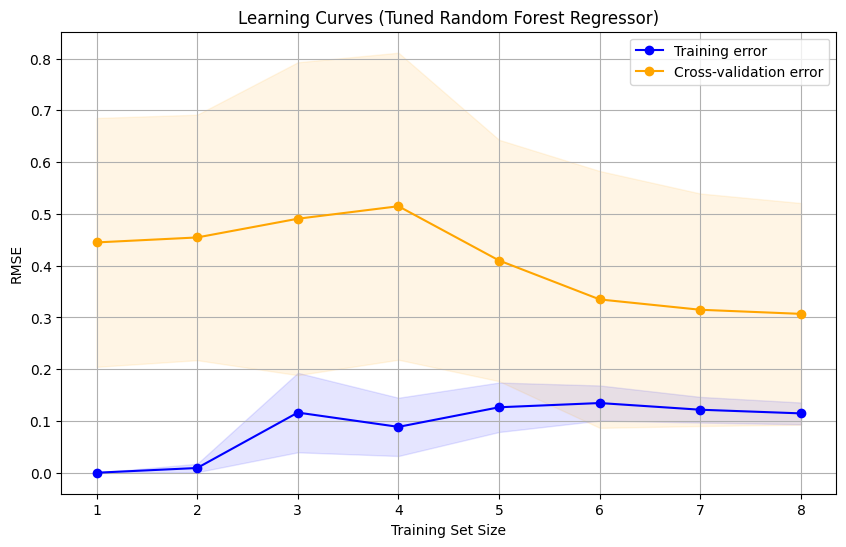
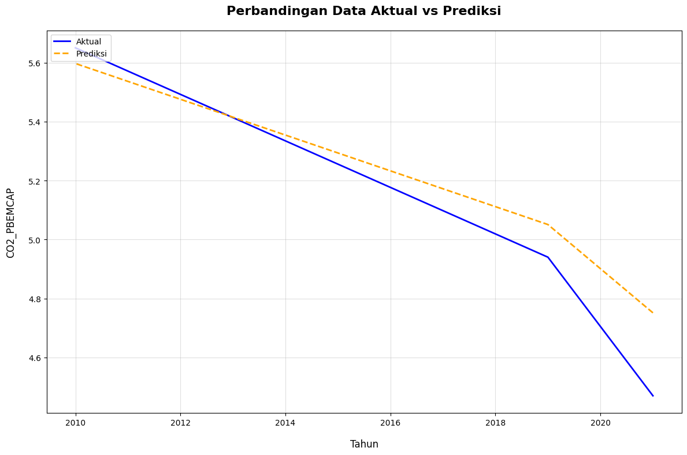

# CO2 Emission Prediction - Spain 🌍💨

**Project Title:** Predictive Analysis of CO2 Emission Contributors Based on Industry and Economy Using Random Forest Regression  
**Case Study:** Spain from 2010 to 2022  
**Theme:** Green Economy 🌱

This project aims to predict CO2 emissions based on industrial and economic indicators in Spain, focusing on the principles of a **Green Economy**. By leveraging **Random Forest Regression**, we aim to identify key drivers of CO2 emissions and promote data-driven strategies to minimize emissions and foster sustainable development.

---

## 🛠️ Project Overview

This project involves several stages of data analysis and modeling, including:

- **Data Preprocessing**: Cleaning and preparing the data for analysis to ensure quality results.
- **Exploratory Data Analysis (EDA)**: Uncovering insights through visualizations to understand emission patterns.
- **Feature Encoding & Engineering**: Transforming features to enhance model performance and predictive accuracy.
- **Feature Importance**: Identifying the most influential factors affecting CO2 emissions.
- **Model Building with Random Forest Regressor**: Training a model to predict CO2 emissions and understand the relationship between economic and industrial variables.
- **Hyperparameter Tuning**: Fine-tuning model parameters to improve performance.

---

## 📊 Data Visualization Preview

Here are some key visualizations that demonstrate the results of the **Exploratory Data Analysis** (EDA) process and model performance:

### 1. Learning Curve for Model Accuracy
This graph shows how the model’s accuracy improves with more training data over time.


### 2. Actual vs Predicted CO2 Emissions
This comparison helps visualize how close the predicted CO2 emissions are to the actual values, highlighting the effectiveness of the model.


---

## 📋 How to Run the Project

1. **Clone the repository:**
   ```bash
   git clone https://github.com/ikhsannovianto/co2-emission-prediction-spain.git

---

## 📜 License
This project is licensed under the **MIT License**. You can find the full text of the MIT License in the [LICENSE](LICENSE) file in this repository.
